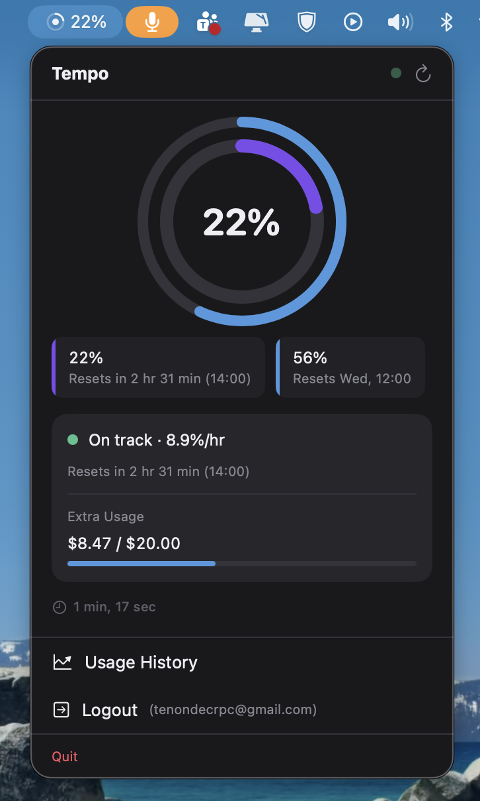

# Tempo — Claude Code Usage Tracker

A macOS menu bar app that tracks your Claude Code token and credit usage in real time, with an Apple Watch companion for haptic alerts when a session ends.



## What it does

- Shows your **5-hour and 7-day utilization** as a ring gauge in the macOS menu bar
- Displays **burn rate**, extra usage, and next reset time at a glance
- Delivers a **haptic alert on your Apple Watch** the moment a Claude Code session ends
- Relays live usage data from macOS → iCloud → iOS → Apple Watch

## Architecture

```
macOS menu bar app (OAuth + poll every 15 min)
  └─ iCloud Drive (usage.json / latest.json)
      └─ iOS companion (NSMetadataQuery)
          └─ WatchConnectivity (transferUserInfo)
              └─ watchOS haptic + usage ring
```

Two independent data pipelines run in parallel:

| Pipeline | Trigger | Data |
|---|---|---|
| **OAuth API** | 15-min poll | Utilization %, reset timestamps |
| **Stop hook** | Session end event | Per-session tokens, cost, duration |

The OAuth API is the authoritative source for utilization — the plan limit is account-specific and never exposed locally. The Stop hook is the only way to deliver an instant haptic the moment a session closes.

## Targets

| Folder | Target | Role |
|---|---|---|
| `ClaudeTracker macOS/` | macOS menu bar app | OAuth sign-in, usage polling, iCloud writer |
| `ClaudeTracker/` | iOS app | iCloud reader, WatchConnectivity sender |
| `ClaudeTracker Watch/` | watchOS app shell | Entry point |
| `ClaudeTracker Watch Extension/` | watchOS extension | All watch UI and haptic logic |
| `Shared/` | Shared code | Data models, business logic (no UI frameworks) |

## Getting started

1. Open `ClaudeTracker.xcodeproj` in Xcode
2. Enable **Outgoing Connections (Client)** in App Sandbox for the macOS target (required for calls to `platform.claude.com`)
3. Enable **iCloud Documents** on both the macOS and iOS targets using the same container ID (requires an Apple Developer account)
4. Build and run the macOS target
5. Sign in with your Claude account via OAuth — the app opens a browser and lets you paste the authorization code

## Requirements

- macOS 13+ (menu bar app)
- iOS 16+ (companion app)
- watchOS 9+ (haptic alerts and usage ring)
- Apple Developer account (for iCloud Documents entitlement)

## Roadmap

See [`docs/PLAN.md`](docs/PLAN.md) for the full implementation plan, including:

- **Phase 6** — Reset alarm: strong haptic + notification at the exact moment your 5h limit resets
- **Phase 8** — Stats dashboard: session history and watch face complications
- **Phase 9** — Context window tracking: usage gauge per active session with threshold alerts
