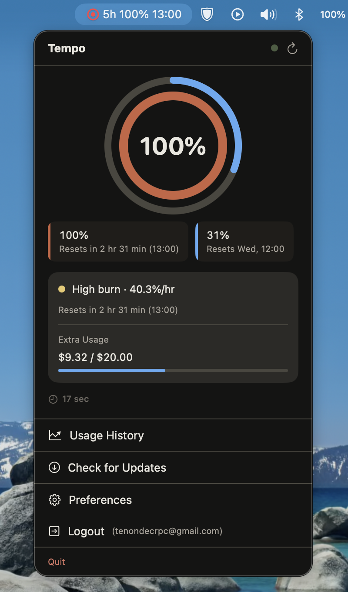
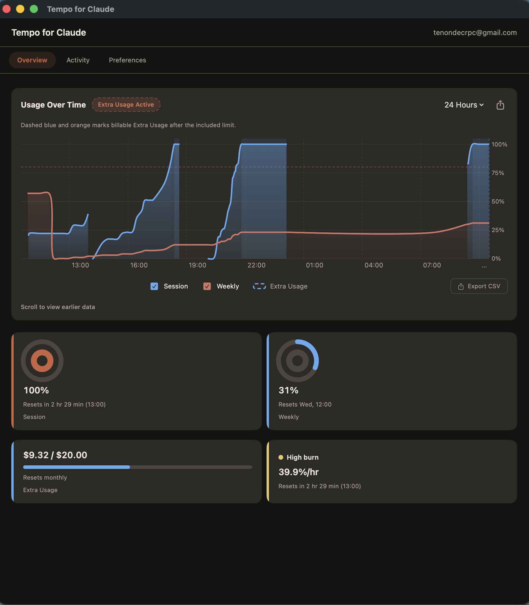
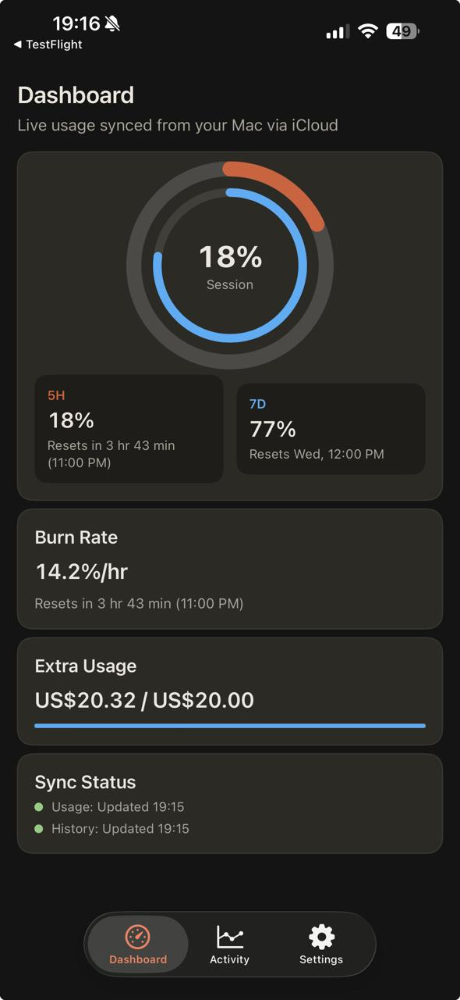
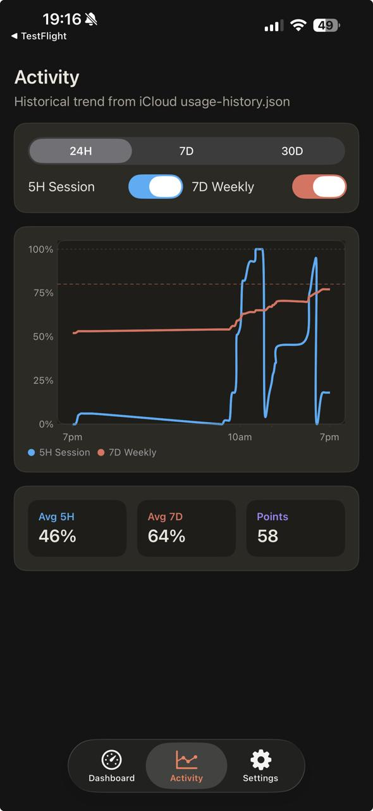
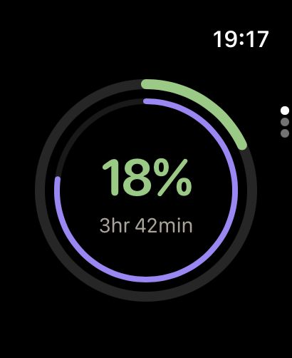

# Tempo for Claude

A macOS menu bar app that tracks your Claude Code token and credit usage in real time, with an Apple Watch companion for haptic alerts when a session ends.

[](https://github.com/tenondecrpc/tempo-for-claude/actions/workflows/build.yml)
[](https://github.com/tenondecrpc/tempo-for-claude/actions/workflows/codeql.yml)
[](https://github.com/tenondecrpc/tempo-for-claude/actions/workflows/dependency-review.yml)
[](LICENSE)

## Join the beta

Want early access to new Tempo builds? You can join the public beta on TestFlight here:

**[Join the Tempo beta on TestFlight](https://testflight.apple.com/join/1VJBBtVS)**

Install the app, try it on your devices, and send feedback while features are still evolving.

## Why this repo is trustworthy

- **CI on pull requests**: the macOS and iOS targets are built automatically in GitHub Actions for every PR.
- **Security checks**: Swift code is scanned with CodeQL, and dependency updates go through automated dependency review.
- **Maintainer review gates**: [`CODEOWNERS`](.github/CODEOWNERS) requires maintainer review for sensitive areas like workflows, project settings, entitlements, and app targets.
- **Structured contribution flow**: bug reports, feature requests, and PRs use templates with testing and risk checklists to keep changes reviewable.
- **Transparent data handling**: Tempo uses no custom backend; usage data stays on your Apple devices through iCloud sync.
- **Open license**: the project is released under the [`MIT License`](LICENSE), so the terms are explicit and easy to audit.

## Screenshots

### macOS menu bar

<p align="center">
  <a href="screenshots/mac-01.png">
    
  </a>
</p>

### macOS desktop windows

<p align="center">
  <a href="screenshots/mac-02.png">
    
  </a>
  <a href="screenshots/mac-03.png">
    
  </a>
  <a href="screenshots/mac-04.png">
    
  </a>
</p>

### iPhone companion app

<p align="center">
  <a href="screenshots/ios-01.jpeg">
    
  </a>
  <a href="screenshots/ios-02.jpeg">
    
  </a>
  <a href="screenshots/ios-03.jpeg">
    
  </a>
</p>

### Apple Watch

<p align="center">
  <a href="screenshots/watch_01.jpeg">
    
  </a>
  <a href="screenshots/watch_02.jpeg">
    
  </a>
  <a href="screenshots/watch_03.jpeg">
    
  </a>
</p>

## What it does

- Shows your **5-hour and 7-day utilization** as a ring gauge in the macOS menu bar
- Displays **burn rate**, extra usage, and next reset time at a glance
- Includes an iOS companion UI (**Dashboard**, **Activity**, **Settings**) styled with Claude tokens
- Shows **local Claude Code activity and project stats** in the macOS detail window
- Ships **widgets on macOS, iPhone, and Apple Watch**
- Delivers a **haptic alert on your Apple Watch** shortly after a Claude Code session ends
- Relays live usage data from macOS -> iCloud (`usage.json`, `usage-history.json`) -> iOS -> Apple Watch

## Architecture

```text
macOS menu bar app
  |- Tempo OAuth / fresh Claude Code CLI fallback -> usage poller -> iCloud Drive (usage.json / usage-history.json)
  |- Claude local session reader -> iCloud Drive (latest.json)
  └- Local Claude stats -> macOS detail window

iOS companion (NSMetadataQuery + dashboard/activity/settings)
  └- WatchConnectivity (application context + transferUserInfo)
      └- watchOS alerts, trend, and usage surfaces
```

Two independent data pipelines run in parallel:

| Pipeline | Trigger | Data |
|---|---|---|
| **OAuth API** | 15-min poll | Utilization %, reset timestamps, usage history snapshots |
| **Claude local data** (`~/.claude/`) | 20-second poll | Session completion events, per-session tokens/duration, local activity stats |

The OAuth API is the authoritative source for utilization - the plan limit is account-specific and never exposed locally. Claude local data powers session completion alerts and richer local stats in the current repo.

Tempo stores its own OAuth credentials in Keychain and uses them as the preferred source for usage polling. A fresh Claude Code CLI access token may be used as a read-only fallback, but Tempo never refreshes, writes, or deletes Claude Code's own credentials. See [`docs/AUTH_FLOW.md`](docs/AUTH_FLOW.md) for the exact auth source order.

## Privacy and data handling

- Tempo does **not** run any custom backend and does **not** store your usage data on third-party servers.
- Data is synchronized only between your Apple devices through your iCloud container.
- iCloud sync and transport rely on Apple's security model and encryption standards.

## Targets

| Folder | Target | Role |
|---|---|---|
| `Tempo macOS/` | macOS menu bar app | OAuth sign-in, usage polling, iCloud writer |
| `Tempo/` | iOS companion app | iCloud reader, dashboard/activity/settings, WatchConnectivity sender |
| `Tempo Watch/` | watchOS app | Watch UI, haptics, local alerts, WatchConnectivity receiver |
| `Tempo macOS Widget/` | macOS widget extension | Desktop widgets backed by shared snapshots |
| `Tempo iOS Widget/` | iOS widget extension | iPhone widgets backed by shared snapshots |
| `Tempo Watch Widget/` | watchOS widget extension | Accessory widget surfaces |
| `Shared/` | Shared code | Data models, widget snapshots, routes, shared logic |

## Getting started

1. Open `Tempo.xcodeproj` in Xcode
2. Use a signing team that supports the committed iCloud container and widget app-group entitlements
3. Build and run the macOS target, then grant access to `~/.claude` when Tempo asks for local Claude Code stats
4. Sign in with your Claude account. Tempo first restores its own Keychain OAuth credentials, may use a fresh Claude Code CLI access token as a read-only fallback, and otherwise opens the OAuth browser flow for a paste-code sign-in.
5. Launch the iOS and watch targets on physical devices if you want live iCloud sync and WatchConnectivity verification

## Requirements

- macOS 13+ (menu bar app)
- iOS 16+ (companion app)
- watchOS 9+ (haptic alerts and usage ring)
- Apple Developer account (for iCloud Documents and widget/app-group entitlements on device)

## Roadmap

See [`docs/PLAN.md`](docs/PLAN.md) for the implementation roadmap and unscheduled backlog.

Current roadmap highlights:

- **Phase 6** - Reset alarm: strong haptic + notification at the exact moment your 5h limit resets
- **Phase 7** - QA and reliability hardening across macOS, iPhone, and Apple Watch
- **Phase 8** - Deeper stats surfaces and richer watch complications
- **Phase 9** - Context window tracking: usage gauge per active session with threshold alerts
